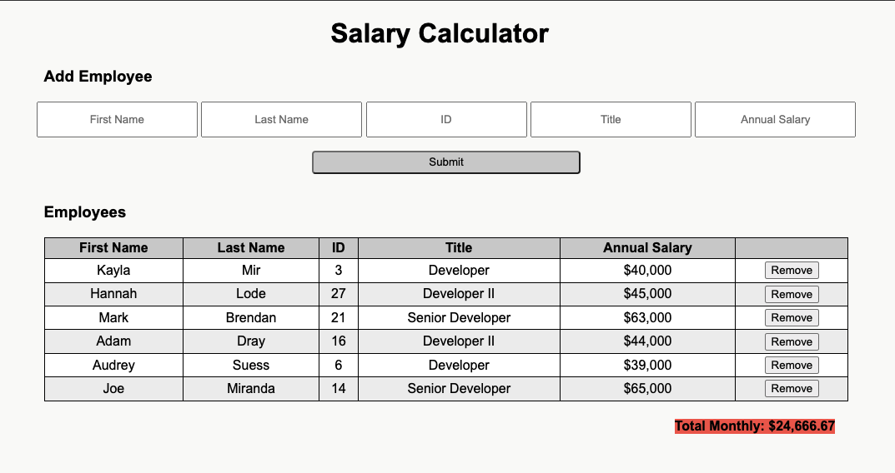

# jQuery Salary Calculator

## Description
___

*Duration: Weekend Project*

This app is a javaScript and jQuery monthly employee salary calculator. Users can add employees and have the app automatically tell them their monthly costs. Additionally they can remove employees and the app will update the costs.

## Screen Shot
___

Additionally the app will warn you when the total monthly cost exceeds the set amount.

### Prerequisites

- None!

## Installation
___

1. This one is super easy, fork and clone it! (everything is included)

## Usage
___

1. Add employee information to the input fields and click "Submit" button.
2. See the employees displayed in a table.
3. Total Monthly Costs are displayed at the bottom of the table.
4. Click "Remove" button to remove an employee.

## Built With
___
- jQuery
- JavaScript
- HTML
- Good ol' CSS

## Acknowledgement
___

Thanks to Prime Digital Academy who equipped and helped me to make this application a reality. Special thanks to my instructor [Matthew Black](https://github.com/matthew-black)!

## Support
___

If you have suggestions or issues, please email me at [kayla.mir32@gmail.com](mailto:kayla.mir32@gmail.com)