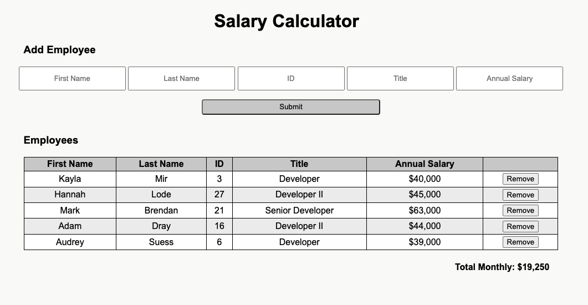

# jQuery Salary Calculator

[Project Instructions](./INSTRUCTIONS.md), this line may be removed once you have updated the README.md

## Description

*Duration: Weekend Project*

Your project description goes here. What problem did you solve? How did you solve it?

This app is a javaScript and jQuery monthly employee salary calculator. Users can add employees and have the app automatically tell them their monthly costs. Additionally they can remove employees and the app will update the costs.

## Screen Shot

Additional README details can be found [here](https://github.com/PrimeAcademy/readme-template/blob/master/README.md).
